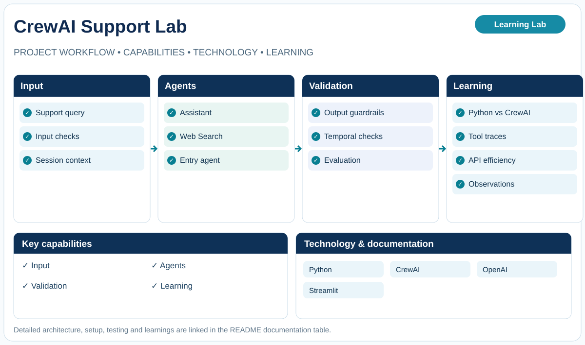

# CrewAI Customer Support Lab

**Learning Lab · Agent orchestration experiments**

Sequential CrewAI workflow with comparative Python experiments.

## What this project explores

- Support question
- Input guardrails
- Sequential CrewAI agents
- Output checks and evaluation
- Response and observations

## Technology

Python · CrewAI · OpenAI · Streamlit

## Documentation

| Document | Details |
|---|---|
| [PROJECT GUIDE](docs/PROJECT-GUIDE.md) | Original detailed project README |

## Scope

This is a learning and engineering portfolio project. Consult the linked documentation for detailed implementation, evidence, limitations, setup and deployment guidance.
